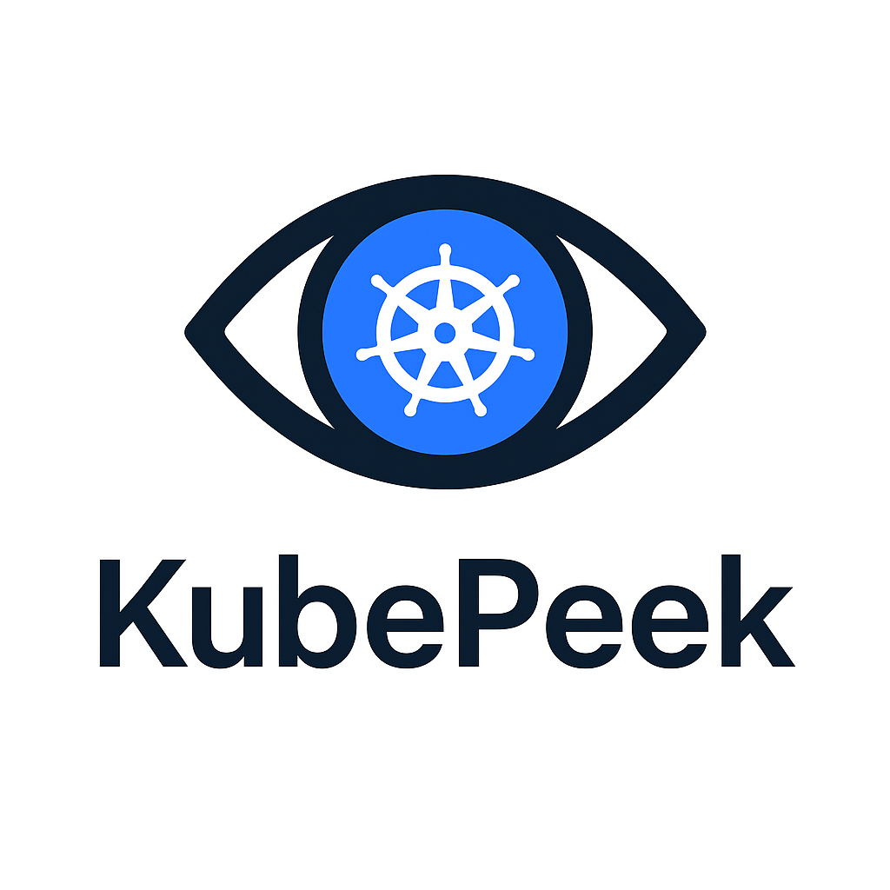

# KubePeek - Next.js Kubernetes Dashboard



## 🚀 Your Kubernetes Clusters, But Way Cooler!

KubePeek is a snazzy web-based Kubernetes monitoring dashboard that connects to your local Kubernetes configuration to give you a bird's-eye view of all your connected clusters. No more squinting at terminal outputs - see your clusters in style!

## ✨ Features

- 📁 Effortlessly reads from your local Kubernetes configuration files
- 🔍 Displays all the juicy details about your Kubernetes clusters
- 🖥️ View node details including:
  - Node group tags
  - EC2 instance names and types
  - CPU and RAM capacity and utilization
  - Number of running pods
- 🛰️ View pod details including:
  - Helm chart name and version
  - CPU and RAM usage
  - Namespace and other metadata
- 📊 Sortable tables for data organization that's actually pleasant
- 🔄 Drill-down functionality from nodes to pods - click your way to enlightenment!

## Getting Started

### Prerequisites

- Node.js 18+
- npm or yarn
- Kubernetes configuration setup locally (`~/.kube/config`)
- Access to the Kubernetes API from your local machine

### Installation

1. Clone the repository
```bash
git clone https://github.com/yourusername/kubepeek.git
cd kubepeek
```

2. Install dependencies
```bash
npm install
# or
yarn install
```

3. Run the development server
```bash
npm run dev
# or
yarn dev
```

4. Open your browser and navigate to [http://localhost:3000](http://localhost:3000)

## Usage

1. The dashboard automatically loads your Kubernetes contexts from your local configuration.
2. Select a cluster from the left sidebar to view its details.
3. The main area will display information about nodes and pods.
4. You can sort columns and filter data as needed.
5. Click on a node to drill down and see pods running on that specific node.

## Technical Details

- Built with Next.js and TypeScript
- Uses Material-UI (MUI) for UI components
- Leverages the official Kubernetes JavaScript client (@kubernetes/client-node)
- Real-time metrics using Kubernetes Metrics API

## Permissions

This application requires read access to your Kubernetes clusters. It uses your existing kubeconfig file and the permissions defined in it.

## License

MIT
