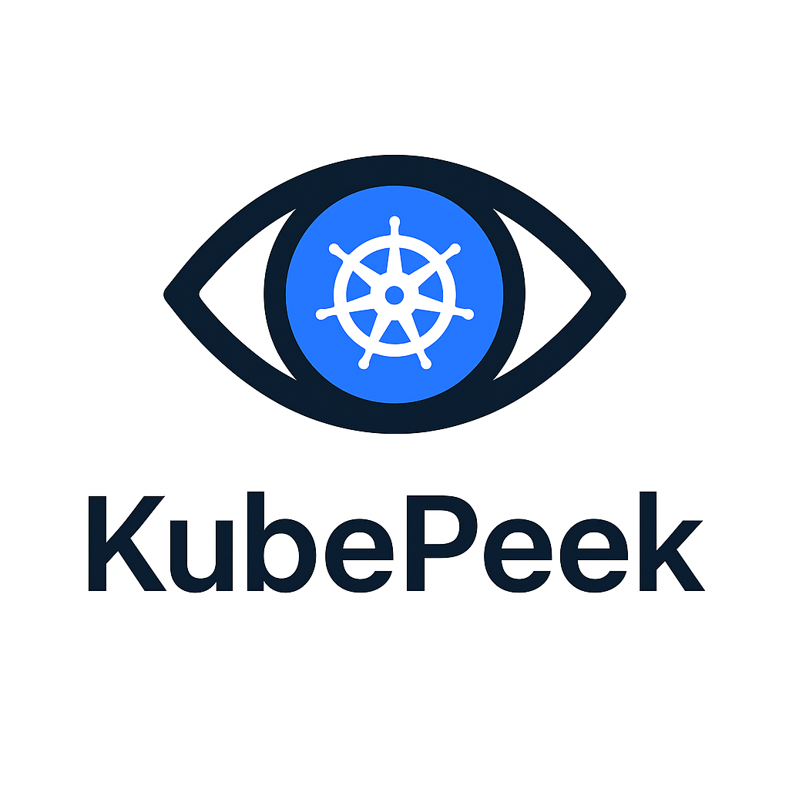
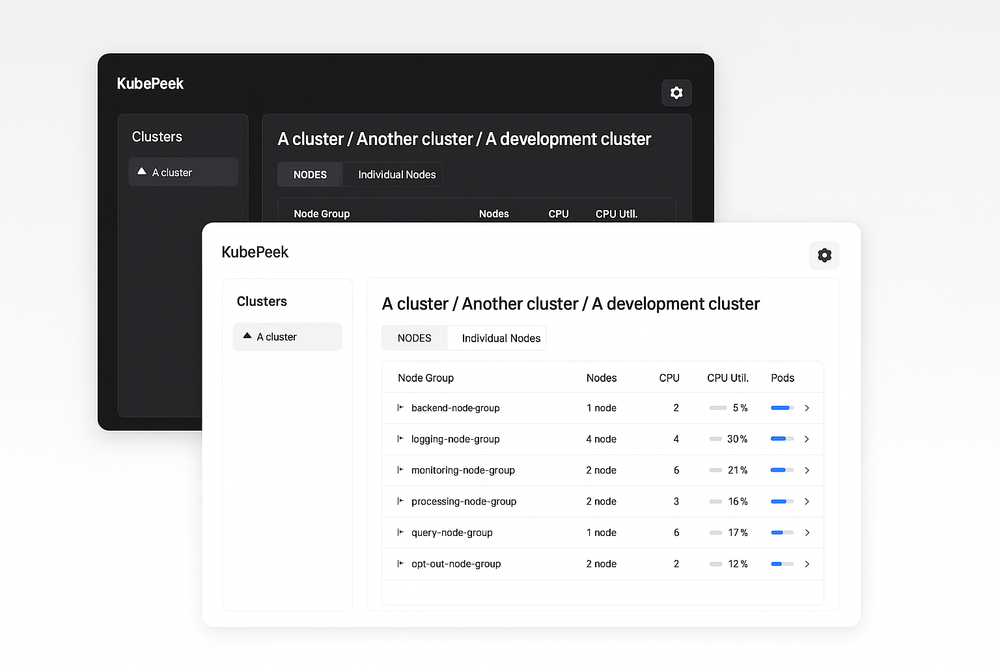

# KubePeek



**A lightweight Kubernetes visibility app for Mac.**

KubePeek reads your local kubeconfig and gives you a fast, Lens-style view of every connected cluster — node groups with per-node CPU/RAM, pods with restart counts and usage bars, and click-through detail for pods (state, events, and logs with a JSON fields filter). It also surfaces two things most lightweight tools skip: **Secrets** (decoded on demand) and **Helm releases** (read straight from release secrets — no helm binary required).

Everything runs locally. The app talks to your clusters using your existing kubeconfig and its permissions; nothing is sent to a cloud service.



> Full documentation lives in [`docs/`](docs/) — see [features](docs/features.md), [architecture](docs/architecture.md), and [development](docs/development.md).

## Requirements

- **macOS 13 (Ventura)** or later (for the native app; Docker works cross-platform)
- **Node.js 18+**
- A kubeconfig at `~/.kube/config` (or `$KUBECONFIG`) with reachable clusters
- For CPU/RAM metrics: [metrics-server](https://github.com/kubernetes-sigs/metrics-server) installed on the cluster
- For EKS: the AWS CLI on your PATH (exec-auth uses `aws eks get-token`)

## Install

```bash
git clone https://github.com/Captain-Sangam/KubePeek.git
cd KubePeek
make install
make dev          # run in development mode (Next dev server + Electron window)
```

To install it as a real app (launchable from Spotlight):

```bash
make export       # packages KubePeek.app into /Applications
```

Prefer a container? See [Running with Docker](docs/development.md#running-with-docker).

## Features at a glance

- **Two-part sidebar** — cluster selector on top; a Compute/Workloads nav tree below (collapses to an icon rail)
- **Node groups** — CPU/RAM usage per node group and per member node, with node start times
- **Pods** — scoped by namespace or node (never cluster-wide), restart counts, CPU/memory usage bars (% of limits → requests → node allocatable); delete with confirmation
- **Pod detail drawer** — status, per-container breakdown, live metrics, events, and logs
- **Logs** — timestamped, with a JSON fields filter (select which structured fields to show) and previous-container logs for crash loops
- **Secrets** — scoped by namespace; reveal-all decoded values in a multi-column layout; delete with confirmation
- **Helm** — read-only releases (scoped by namespace) with computed values, manifest, and revision history
- **One-click reconnect** — when an EKS/AWS token expires, a Reconnect button restores access without restarting

See [docs/features.md](docs/features.md) for the full list.

## License

MIT
