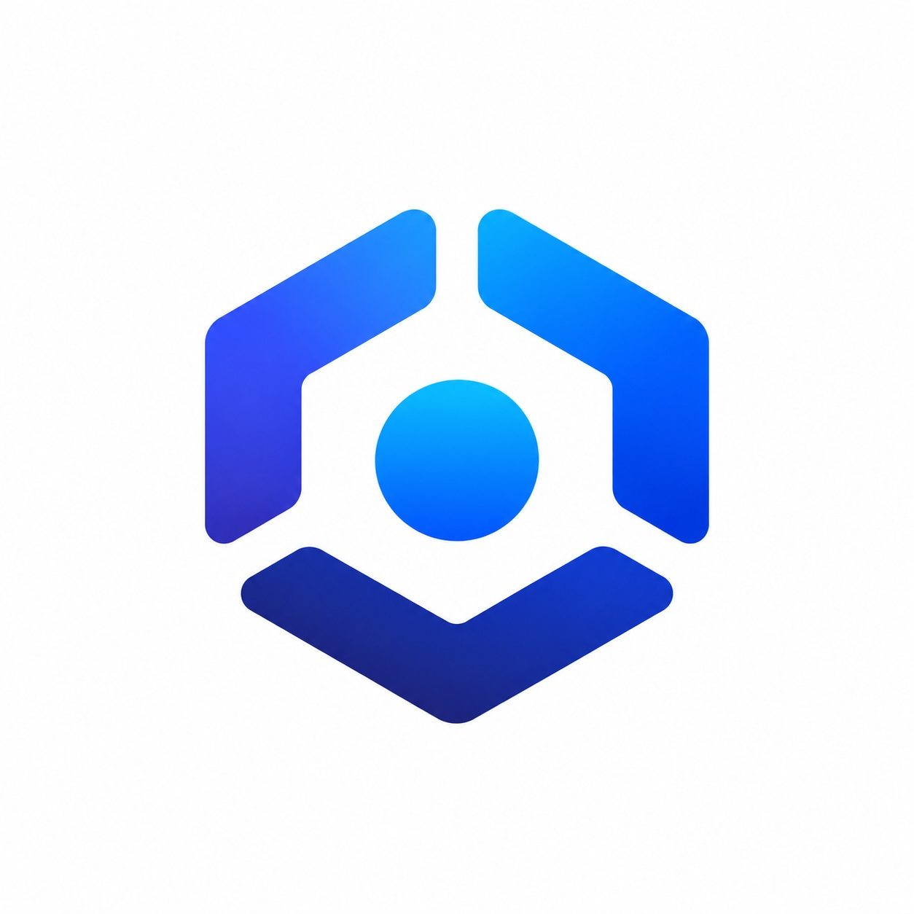

<p align="center">
  
</p>

<h1 align="center">KubePeek</h1>

<p align="center"><strong>A lightweight, local Kubernetes dashboard for macOS and Docker.</strong></p>

<p align="center">
  <a href="#build-from-source">Get started</a> ·
  <a href="docs/features.md">Features</a> ·
  <a href="#documentation">Documentation</a> ·
  <a href="https://github.com/Captain-Sangam/KubePeek/issues">Report a bug</a>
</p>

KubePeek turns your existing kubeconfig into a live view of your clusters. See where pods run, inspect CPU and memory usage, follow events and logs, and explore workloads, secrets and Helm releases from one interface.


Everything runs locally, using your kubeconfig and its existing permissions. There is no KubePeek cloud service, account or telemetry. The native app and browser share the same interface.

Screenshots use fictional demo data with secret values masked.

## Highlights

- **Live cluster views** — automatic refresh with preserved filters, sorting and scroll, plus freshness and stale-data indicators.
- **Compute Map** — status-colored pod tiles grouped by node, with pod counts and information on hover or keyboard focus. The map has no actions.
- **Nodes and node groups** — CPU/RAM, start times, instance types and provider-label Spot, On-Demand or Unknown classification.
- **Scoped pod inspection** — filter by namespace, node or node group; inspect container metrics, restart counts, events and searchable logs with a JSON fields filter.
- **Secrets on demand** — namespace-scoped lists, masked values, manual reveal, searchable keys and hidden-by-default TLS secrets.
- **Helm without a Helm binary** — read-only releases, computed values, manifests and revision history decoded from release secrets.
- **Workload tables** — Deployments, Ingresses and HPA with readiness, addresses and autoscaler metrics.
- **A compact workspace** — persistent tabs, namespace memory, Cmd/Ctrl+F search, fast light/dark switching and reconnect after refreshing expired credentials.

Pod and secret deletion require confirmation. Reserved Instance billing coverage is not inferred from node labels. See the [feature guide](docs/features.md) for refresh intervals and full behavior.

## Requirements

- macOS 13 or newer for the native app; Docker works across platforms.
- Node.js 20 or newer when building from source.
- A reachable Kubernetes cluster and a kubeconfig at `~/.kube/config` or `$KUBECONFIG`.
- [metrics-server](https://github.com/kubernetes-sigs/metrics-server) and Metrics API permissions for CPU/RAM readings. Missing metrics display `n/a`.
- The AWS CLI on your `PATH` for EKS exec-auth, or the credential helper configured by your kubeconfig.

## Build from source

1. Clone the repository:

```sh
git clone https://github.com/Captain-Sangam/KubePeek.git
cd KubePeek
```

2. Install dependencies:

```sh
make install
```

3. Build and install the macOS app:

```sh
make export
```

Launch **KubePeek** from Spotlight or Applications. The app is installed into `/Applications`, or `~/Applications` if needed. Local builds are unsigned and not notarized; no developer certificate is required.

To build the app in `dist/` without installing it, use `npm run dist`.

### Development

```sh
make dev            # Next.js dev server and an Electron window
npm run dev:web     # Browser-only development at localhost:3000
make start          # Build and run the production server at localhost:3000
```

Run one mode at a time. See the [development guide](docs/development.md) for commands, packaging and troubleshooting.

## Run with Docker

Build a local production image from the repository:

```sh
docker build -t kubepeek .
docker run -d -p 127.0.0.1:3000:3000 \
  -v "$HOME/.kube:/root/.kube" \
  -e KUBECONFIG=/root/.kube/config \
  --name kubepeek kubepeek
```

Open [localhost:3000](http://localhost:3000). Your cluster's API address must be reachable from inside the container. For EKS, also mount your AWS credentials as described in the [Docker guide](docs/development.md#running-with-docker). Published-image commands are in [DOCKERHUB.md](DOCKERHUB.md).

## Compute Map

Pods lead the overview: status-colored tiles, pod totals and information on hover or keyboard focus. Node captions provide context, with capacity and usage available in their previews. Unscheduled pods remain visible, and missing metrics show `n/a`.

The map refreshes while active and pauses while the window is hidden. It provides information without node or pod actions.

<details>
<summary>Pod hover details and light theme</summary>


</details>

## Documentation

- [Features and screenshots](docs/features.md)
- [Development and packaging](docs/development.md)
- [Architecture](docs/architecture.md)
- [Privacy and security](docs/SECURITY.md)
- [Docker image](DOCKERHUB.md)
- [Changelog](docs/CHANGELOG.md)

## Contributing

Contributions are welcome. Read the [contribution guide](docs/CONTRIBUTING.md) for setup, code boundaries and the recipe for adding a resource view.

Before opening a pull request, run:

```sh
make typecheck
npm run lint
make build
```

Report bugs and propose features through [GitHub issues](https://github.com/Captain-Sangam/KubePeek/issues). Follow the [security policy](docs/SECURITY.md#reporting-a-vulnerability) for vulnerability reports.

## License

KubePeek is available under the [MIT License](LICENSE).
