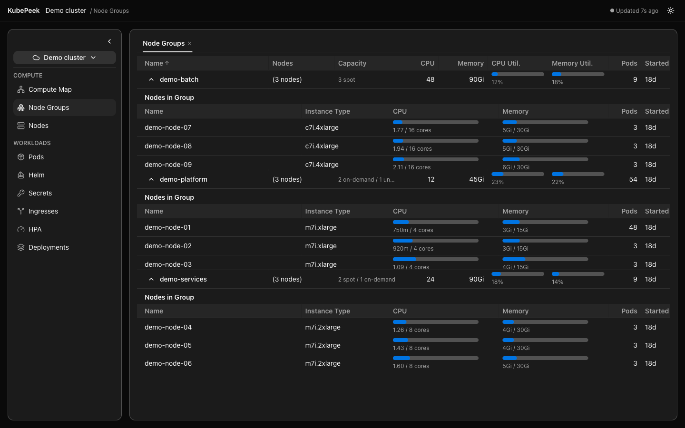
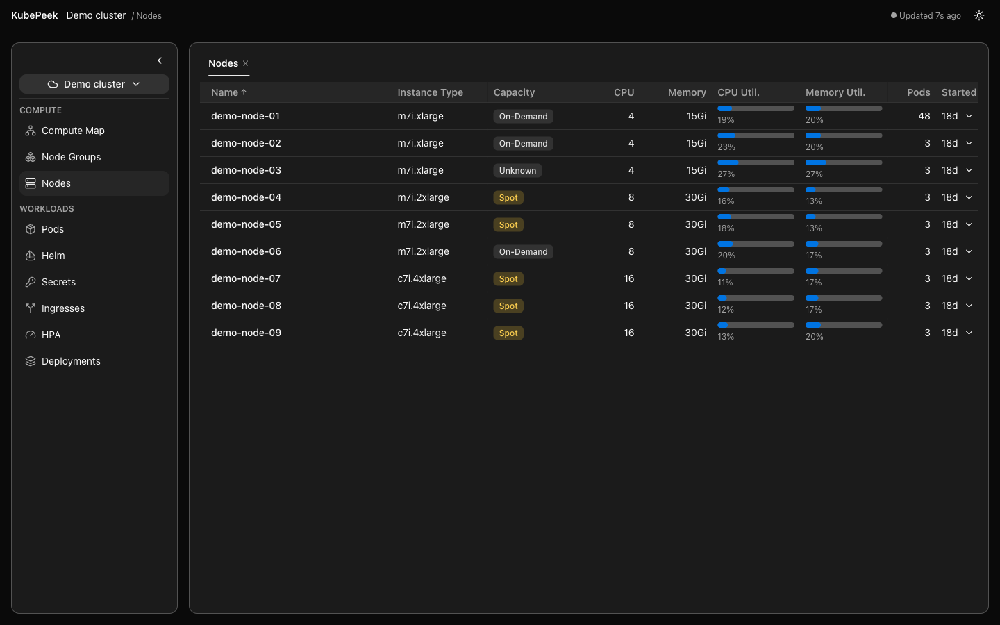
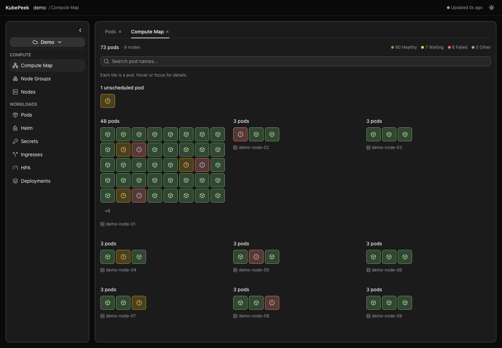
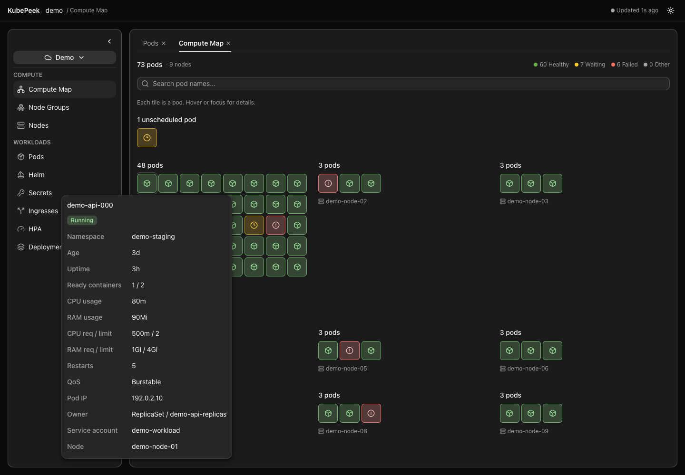
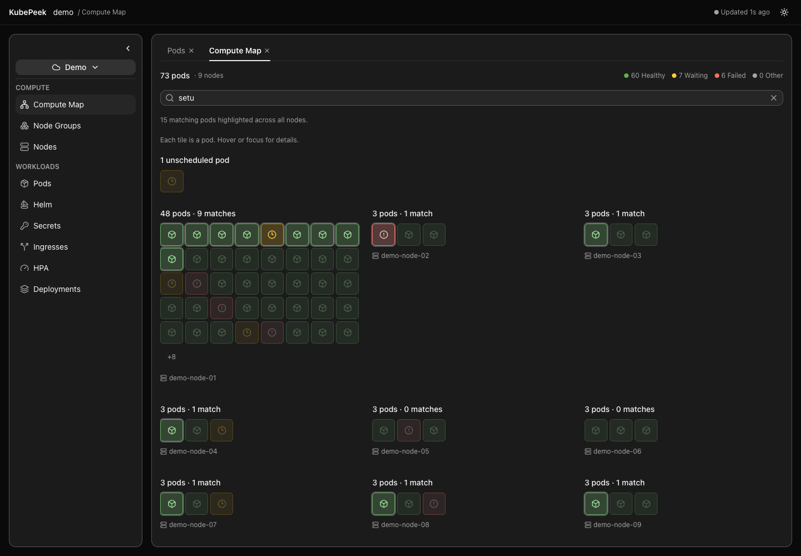
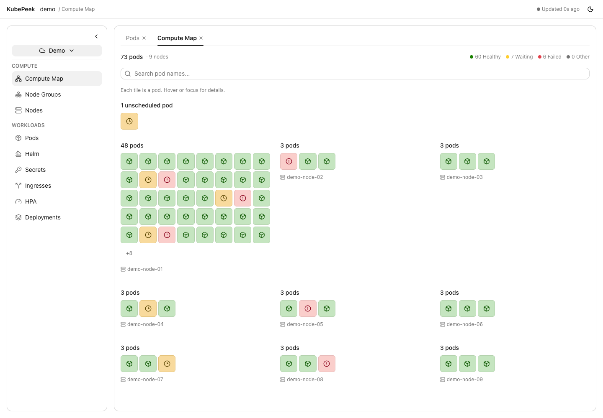
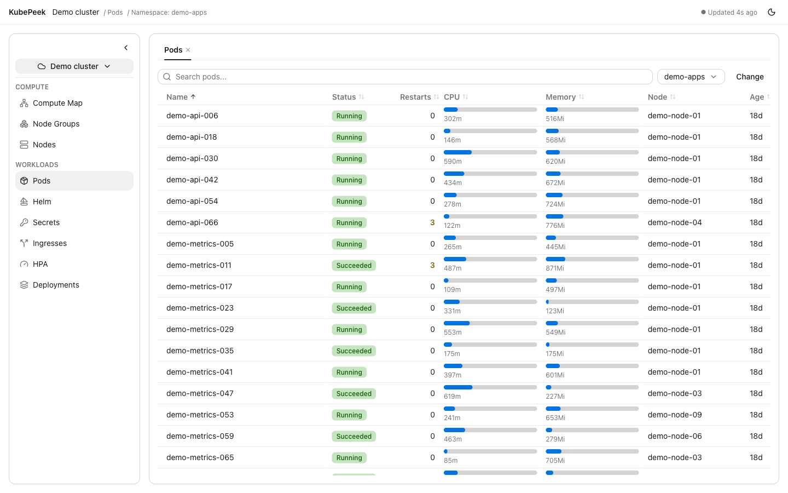
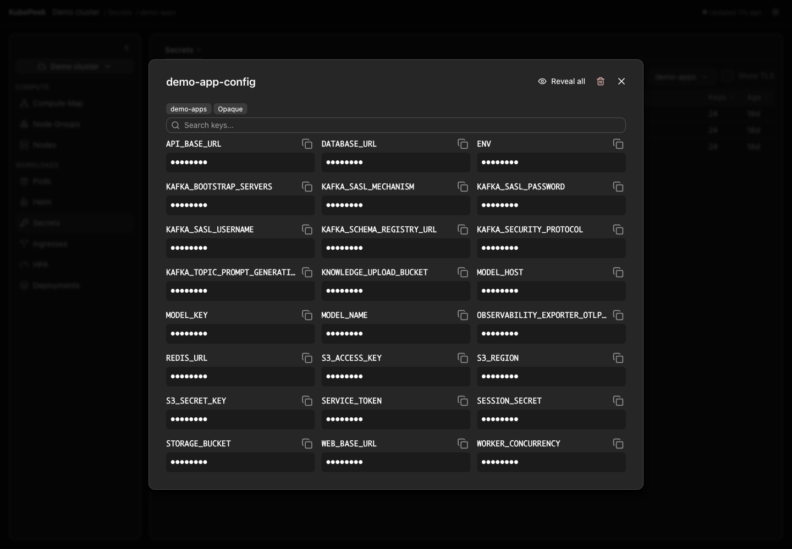
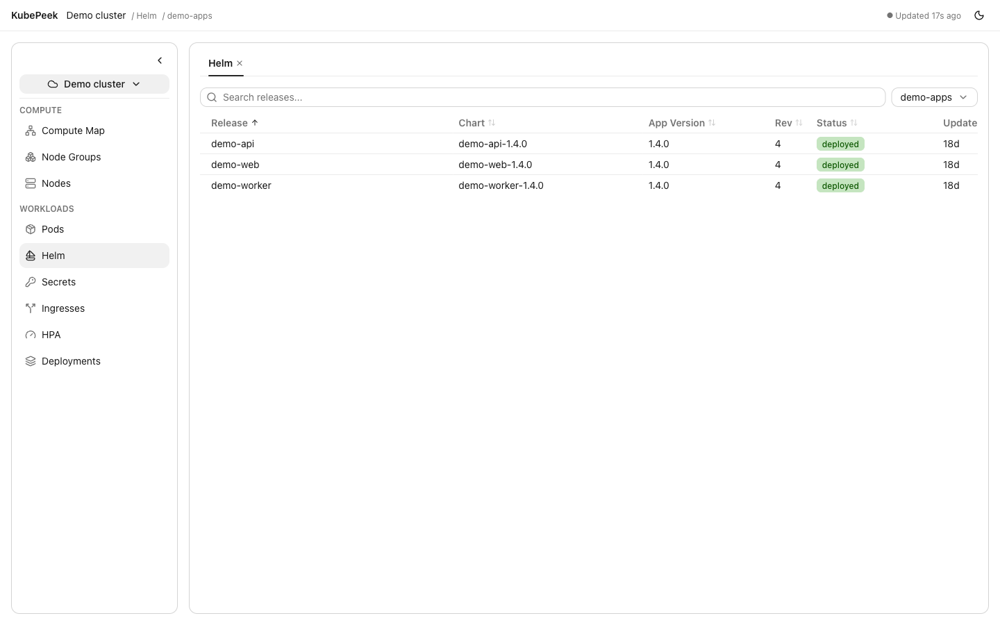

# Features

## Clusters & navigation

- Reads every context from your kubeconfig (`$KUBECONFIG` → `~/.kube/config` → common fallbacks).
- The left sidebar has two parts: a **compact cluster selector** at the top and a **navigation tree** below, grouped into **Compute** (Node Groups, Nodes, Compute Map) and **Workloads** (Pods, Helm, Secrets, Ingresses, HPA, Deployments).
- The main pane is **tabbed**: clicking a sidebar item opens that view as a tab (or focuses it if already open — one tab per view, closable with ×). Each open tab keeps its own state — search text, sorting, namespace, loaded data — when you switch away and back. The app opens on a Pods tab.
- **Namespace memory**: opening a new namespace-scoped tab defaults to the last namespace you picked in any tab (skipping the picker); after that each tab's namespace is independent.
- Rename any cluster to a friendly display name (stored locally) from the selector's menu.
- The sidebar **collapses to an icon rail** (cluster avatar + nav icons with tooltips) to reclaim screen space. The collapsed state is remembered across launches.
- **Cmd+F** (Ctrl+F) focuses the search box of whatever is in front: the active tab's table, the secret detail dialog, or the Helm values/manifest view.
- The header shows the **cluster, active view, scope and data freshness**. In the native app it is draggable, with clearance for the macOS window controls.
- Light/dark switching takes **100ms**; reduced-motion preferences disable the transition.

## Live refresh

Only the active view polls. Switching away keeps its data, search, sorting and scope mounted; switching back resumes refresh. Background refresh keeps the existing rows and scroll position visible.

| Data | Refresh interval |
|---|---|
| Nodes, Node Groups, scoped Pods | 15 seconds |
| Open pod overview | 15 seconds while the Pods view is active |
| Namespace choices, Secrets list, Helm list and open release detail, Deployments, Ingresses, HPA, open pod events | 30 seconds |
| Compute Map nodes and cluster-wide pods | 45 seconds |
| Decoded secret values | Manual reveal only |
| Pod logs | Manual refresh or a container/tail selection change |

The header shows when data was last updated and a refresh indicator. A failed background refresh retains the last successful data and marks it **Stale**. Requests do not overlap. Polling pauses while the window is hidden or authentication has expired; returning to a visible window refreshes immediately.

Unavailable CPU/RAM metrics display **n/a**, rather than zero usage. Group utilization is unavailable if a member node has missing metrics.

### Reconnecting after a token expires

When cluster credentials expire, KubePeek shows a **Reconnect** banner and pauses polling. Refresh your AWS SSO/VPN session externally, then click Reconnect — no need to restart the app.

## Nodes and node groups

- Groups nodes by managed-Kubernetes conventions: EKS (`eks.amazonaws.com/nodegroup`), kOps (`kops.k8s.io/instancegroup`), GKE (`cloud.google.com/gke-nodepool`), AKS (`agentpool`).
- Per node group: total CPU/memory, aggregate usage bars, pod count, and counts of Spot, On-Demand and Unknown nodes.
- **Expand a node group** to see compact member rows with bounded CPU/RAM bars and **when each node started** (relative age with a full-timestamp tooltip). Long names and instance types stay on one line with full-text tooltips.
- The **Nodes** sidebar item shows individual nodes with purchasing labels and CPU/RAM utilization. CPU and memory capacity can be sorted separately.
- Purchasing labels come from explicit EKS, Karpenter, GKE or Azure labels. Hover a capacity label to see its source. Missing or unsupported labels display **Unknown**. Reserved Instance and other reservation billing coverage is not inferred from node labels and remains deferred.
- Node CPU uses capacity; node memory uses allocatable memory as its denominator.

## Compute Map

- A read-only cluster overview under **Compute**, available without selecting a namespace.
- **Pods lead the view**: large status-colored tiles, a prominent total and status counts. Healthy pods use green, waiting pods yellow, failure states red, and other states gray; different glyphs also distinguish these categories.
- Hover or keyboard-focus a pod for its full name, namespace, age, uptime, ready/total containers, CPU/RAM usage and requests/limits, restarts, QoS, pod IP, owner, service account and assigned node. Uptime measures time since the oldest currently running regular container started; missing start times show `—`.
- **Search pod names** across every namespace and node using a case-insensitive substring. Matching tiles have a bright outline; other pods are dimmed while all node groups remain visible. The total match count updates with live data. Cmd/Ctrl+F focuses search; clear it to restore the normal map.
- Pods are grouped by node, with the busiest groups first. Node names are small supporting captions below the tiles; hover or focus a caption for instance type, group, purchasing label and node CPU/RAM.
- Each group normally displays up to 40 pod tiles, followed by a remaining-count indicator. During search, matches lead each group and **every matching pod is displayed**, including matches beyond the normal limit. Unscheduled pods appear before the scheduled groups and participate in search. Empty nodes are summarized rather than taking space in the main map, and pods remain visible if their node details are unavailable.
- There are no node or pod actions in this view. It reads cluster-wide pods, independently of the scoped Pods table.

Compute Map in light mode

All screenshots in this guide use fictional demo data, including node names and namespaces. Secret values stay masked.

## Pods

- **Scoped table loading** — opening Pods asks you to pick a **namespace** or a **node**; only then are matching pods fetched server-side. Clicking a node or node group in Nodes/Node Groups opens Pods with that scope. The separate Compute Map reads cluster-wide pods.
- Change the scope from the toolbar (namespace/node dropdown, or the node-group chip), or use **Change** to pick a different scope.
- Columns: name, status, **restart count**, CPU and memory **usage bars**, node, age. The namespace column appears only for node/node-group scopes; namespace-scoped tables omit it.
- Usage bars show consumption as a percentage of the applicable denominator, following a **limits → requests → node allocatable** fallback. The tooltip states which denominator was used.
- Restart counts are color-coded (amber when > 0, red when high).
- A **search** box filters the loaded pods by name, namespace, status, chart, or node.
- Sorting handles mixed units correctly (e.g. `900Mi` sorts below `1.2Gi`).

## Pod detail

Clicking a pod opens a right-side drawer with three tabs:

- **Overview** — phase, QoS class, conditions, node/node group, creation time; pod-level CPU/memory bars; a per-container breakdown (state + reason, image, restarts, requests/limits, live usage); and metadata (labels, owner references, volumes).
- **Events** — the pod's events (type, reason, message, count, age) newest-first, with a refresh button.
- **Logs** — see below.

A **delete** action (with confirmation) is available in the drawer header; on success the pod list refreshes.

## Logs

- Fetched with timestamps; container and tail-length (100/500/1000/2000) selectors.
- A **search box** (Cmd+F) filters the visible log lines by substring.
- **Fields filter**: structured (JSON) log lines are parsed and their keys flattened to dot-notation. Toggle "Fields" to pick exactly which fields to display — the log view then shows only those values. Includes a searchable key list with Selected/Available sections and All/None shortcuts.
- Log level is color-coded via a left border (ERROR red, WARN yellow, INFO green, DEBUG grey).
- **Previous** toggle shows the previous container's logs — the view you want when a pod is crash-looping.
- Auto-scrolls to the newest line, with a scroll-to-bottom button.
- Use **Refresh** to fetch newer logs; logs do not poll or stream automatically.

## Secrets

- **Scoped loading** — like Pods, Secrets are never loaded cluster-wide. Pick a **namespace** first; only that namespace's secrets are fetched. Helm release secrets are excluded (they appear under Helm).
- Table (name, type, key count, age) with search; the selected namespace appears in the toolbar and header, rather than repeated in each row.
- **TLS secrets (`kubernetes.io/tls`) are hidden by default** — tick "Show TLS" in the toolbar to include them.
- Clicking a secret opens a dialog listing its keys with values masked. A single **Reveal all / Hide all** button decodes and shows every value (fetched on demand, server-side); each key has a copy button, and binary values are flagged and shown as base64 rather than mangled text. Keys are laid out in a **responsive grid** (up to three columns on wide screens) so secrets with many keys use the horizontal space instead of a long scroll.
- Long keys stay on one line with a full-key hover tooltip. Value boxes align at the top, and long values scroll within a 160px height cap.
- Decoded values never poll and are cleared when the dialog closes or switches to another secret. The secret list refreshes independently.
- The dialog has its own **key search** (Cmd+F) for secrets with many keys — it matches key names, and values too once revealed.
- A **delete** action (with confirmation) is in the dialog header; on success the secret list refreshes.

## Helm

- Read-only. Releases are decoded directly from their `sh.helm.release.v1` secrets — **no helm binary required**.
- Pick a namespace before loading. Table: release, chart, app version, revision, status, updated; the namespace appears in the toolbar and header.
- Clicking a release opens a drawer with **Values** (computed: chart defaults merged with user overrides), **Manifest**, and **History** (all revisions).
- Values and Manifest have a **search box** (Cmd+F) that grep-filters the YAML lines; Copy always copies the full text.

## Deployments, Ingresses & HPA

All three follow the same scoped pattern as Secrets: pick a namespace, then a searchable, sortable table (Cmd+F works), with the namespace changeable from the toolbar.

- **Deployments** — ready (highlighted when below desired), up-to-date, and available replica counts, plus age.
- **Ingresses** — ingress class, hosts, load-balancer address, age.
- **HPA** — scale target reference, min/max/current replicas, and current-vs-target metrics (e.g. `cpu: 62%/80%`), read from `autoscaling/v2`.
